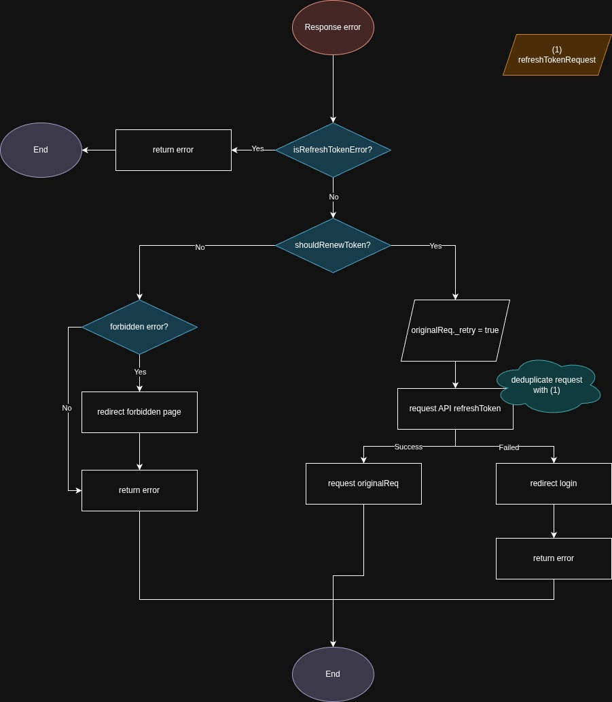

# This project for testing refresh token flow on client & server

## Pre-setup

Installing nix packages (update alter)

## Setup development environment

```bash
git -C "/place-to-project/refresh-token" add "flake. Nix"
nix develop # setup environment for current shell section
```

## How to serve the app
```bash
bun run serve
```

## Refresh token flow

Not sure, just place the preview refresh token flow here (on client)



Import diagram on drawio, get the file [here](./docs/refresh_token_FE.drawio)