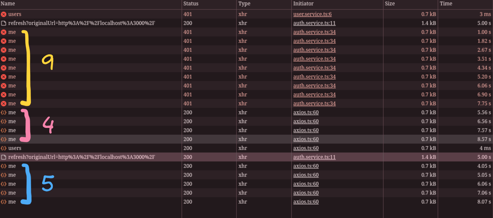

# Question:


```typescript
apiService.interceptors.response.use(
  function (response) {
    return response.data
  },
  async function (error) {
    console.log("🚀 ~ error:", error)
    //TODO: handle error 404, 500
    let refreshTokenSuccess = false
    const originalRequest = error.config
    console.log("🚀 ~ originalRequest:", originalRequest)
    const isRefreshTokenError = error.config.url === authEndpoint.refreshToken()
    const shouldRenewToken =
      error.response?.status === HttpStatusCode.Unauthorized && !originalRequest._retry
    console.log("🚀 ~ shouldRenewToken:", shouldRenewToken)

    if (isRefreshTokenError) return Promise.reject(error)

    if (shouldRenewToken) {
      originalRequest._retry = true
      
      console.log("🚀 ~ refreshTokenRequest:", refreshTokenRequest)
      try {
        refreshTokenRequest = refreshTokenRequest ?? apiAPIService.refreshToken()
        const response = await refreshTokenRequest
        console.log("🚀 ~ response:", response)
        // refreshTokenSuccess = response.success
        refreshTokenSuccess = true
      } catch (_refreshError) {
        refreshTokenSuccess = false
      } finally {
        refreshTokenRequest = null
      }

        console.log("🚀 ~ refreshTokenSuccess:", refreshTokenSuccess)
      if (refreshTokenSuccess) return apiService(originalRequest)
      apiAPIService.redirectLogin()
      return Promise.reject(error)
    }

    if (error.response?.status === HttpStatusCode.Forbidden)
      window.location.href = '/forbidden'

    return Promise.reject(error)
  },
)
```

- the first request get users failed 401 then it request refresh token for it, during the time await for the refresh token response. I requested 9 more requests, 4 of them is during the await time, 5 others after received response from refresh token request. 
- then first 4 requests will be triggered to retry, but the 5 others must await the new refresh token request to response and then retry.
- why it work like that and how to I reduce/deduplicate the request refresh token when it just renew? 
- explain like a senior frontend developer with best javascript practice

# Answer:
Alright, this is a **classic token-refresh race condition**, and your screenshots + interceptor code make it very clear what’s happening. I’ll walk through **why it behaves exactly like this**, then show you the **senior-level fix pattern** that stops the refresh storm and deduplicates retries.

---

## What’s actually happening (timeline)

Let’s narrate your network tab like a movie 🎬

### 1️⃣ First request fails

* `GET /users` → **401**
* Enters interceptor
* `shouldRenewToken === true`
* `_retry` is set
* **refresh token request is fired**
* `await refreshTokenRequest` → interceptor is now *paused*

This is the key moment.

---

### 2️⃣ While refresh is in flight → more requests happen

You send **9 more requests** while refresh is pending.

#### The first **4 requests** (during `await refreshToken`)

* They also get **401**
* Each enters the interceptor
* `_retry` is still `false` for them
* `refreshTokenRequest` is **already set**, so they do:

```ts
refreshTokenRequest = refreshTokenRequest ?? apiAPIService.refreshToken()
```

👉 They **reuse the same Promise**

So they:

* do NOT fire another refresh request
* `await refreshTokenRequest`
* once refresh resolves → retry themselves

✅ This part is actually good behavior already

---

### 3️⃣ Refresh resolves

* Token is updated (probably via cookie or storage)
* `refreshTokenRequest = null`

Now the world looks normal again.

---

### 4️⃣ The last **5 requests** (after refresh completed)

These requests:

* Were sent **after refresh finished**
* Still carried the **old access token** (very common in SPAs)
* So they also get **401**
* Interceptor sees:

  * `_retry === false`
  * `refreshTokenRequest === null`

🚨 **Boom — a second refresh cycle starts**

That’s why you see:

* 1 refresh
* then a gap
* then another refresh
* and another wave of retries

This is **expected with your current logic**.

---

## Why `_retry` doesn’t protect you

`_retry` is **request-local state**.

It prevents:

> “this same request retrying infinitely”

It does **NOT** prevent:

> “multiple requests triggering refresh across time”

That’s why `_retry` alone is insufficient.

---

## The real problem (root cause)

You are missing **global refresh coordination**.

Right now:

* Requests decide **individually**
* There is no concept of:

  * “refresh already succeeded”
  * “wait until token is updated before sending new requests”

---

## Senior-level solution: refresh lock + request queue

The correct pattern has **3 rules**:

1. **Only ONE refresh request at a time**
2. **All 401 requests wait for it**
3. **Requests sent during refresh must pause before hitting the API**

This is how production apps do it.

---

## Step 1: Global refresh state

```ts
let isRefreshing = false
let refreshPromise: Promise<void> | null = null
let requestQueue: Array<(token: string) => void> = []
```

---

## Step 2: Token update helper

```ts
function processQueue(token: string) {
  requestQueue.forEach(cb => cb(token))
  requestQueue = []
}
```

---

## Step 3: Axios response interceptor (correct version)

```ts
apiService.interceptors.response.use(
  response => response.data,
  async error => {
    const originalRequest = error.config

    if (
      error.response?.status !== 401 ||
      originalRequest._retry ||
      originalRequest.url === authEndpoint.refreshToken()
    ) {
      return Promise.reject(error)
    }

    originalRequest._retry = true

    // 🚦 If refresh already in progress → queue
    if (isRefreshing) {
      return new Promise(resolve => {
        requestQueue.push(() => {
          resolve(apiService(originalRequest))
        })
      })
    }

    // 🔒 Lock refresh
    isRefreshing = true

    try {
      refreshPromise = apiAPIService.refreshToken()
      await refreshPromise

      // token is now updated (cookie / storage)
      processQueue(getAccessToken())

      return apiService(originalRequest)
    } catch (e) {
      requestQueue = []
      apiAPIService.redirectLogin()
      return Promise.reject(e)
    } finally {
      isRefreshing = false
      refreshPromise = null
    }
  }
)
```

---

## Step 4: OPTIONAL but VERY important — request interceptor

To fix the **“5 requests after refresh still had old token”** issue:

```ts
apiService.interceptors.request.use(config => {
  const token = getAccessToken()
  if (token) {
    config.headers.Authorization = `Bearer ${token}`
  }
  return config
})
```

Without this, requests created **before refresh finished** still carry stale headers.

---

## Why this works (and yours doesn’t)

| Behavior                | Your Code        | Fixed Version   |
| ----------------------- | ---------------- | --------------- |
| Only one refresh        | ⚠️ Mostly        | ✅ Guaranteed    |
| Requests during refresh | ⚠️ Partial       | ✅ Queued        |
| Requests after refresh  | ❌ Can re-trigger | ✅ Use new token |
| Race conditions         | ❌ Yes            | ✅ No            |
| Refresh storm           | ❌ Possible       | ✅ Impossible    |

---

## Mental model (remember this)

> **Refresh token is a global resource, not a per-request concern**

Once you think of it that way, the queue + lock pattern becomes obvious.

---

If you want, next we can:

* refactor this into a clean `AuthManager`
* add cancellation support
* handle refresh expiry properly
* or convert this to **Axios v1 / Fetch** best practices

Just say the word 👌

# Question:
- the token will be set by serve as httponly, dont have any way to get and I dont want to take that from cookie as well. is there any way to handle it like make another request but with the newest token. can give a real world example for it

# Answer:
Great constraint to call out — this changes the shape of the solution, but **it’s still solvable and very common in real production systems** (especially finance / enterprise apps).

You’re doing **HttpOnly cookies**, which means:

* ✅ JS **cannot read** access token
* ✅ More secure (XSS-resistant)
* ❌ You **cannot re-attach tokens manually**
* ❌ You must rely on **browser cookie handling**

So the question becomes:

> “How do I make sure retried requests use the *new* token if I can’t read it?”

Let’s break this down like we would in a real code review.

---

## Key truth (important)

When the server sets a new token via **`Set-Cookie`**:

* The browser **automatically** attaches it to **future requests**
* BUT only **after the refresh response is fully resolved**

So your job is **not to inject tokens**, but to **control timing**.

> ⏱️ *Who is allowed to make requests while refresh is happening?*

---

## Why your current code still re-fires refresh

Even with HttpOnly cookies:

* Requests created **before refresh completes**
* Are already “in flight” with **old cookies**
* They get `401`
* They **start a new refresh cycle**

This has nothing to do with reading cookies — it’s about **request timing**.

---

## The real-world pattern with HttpOnly cookies

### 🔐 Pattern name (industry standard)

> **“Refresh Lock + Request Gate”**

Used by:

* Google internal apps
* Banking dashboards
* Stripe admin
* Auth0 dashboard
* Any SPA with HttpOnly auth

---

## Mental model (very important)

Think of refresh as a **traffic light** 🚦

* 🟥 Refreshing → **no API requests allowed**
* 🟩 Refresh done → requests resume automatically

You don’t retry with a token.
You **delay requests until cookies are updated**.

---

## Step 1: Global refresh gate

```ts
let isRefreshing = false
let refreshPromise: Promise<void> | null = null
let pendingRequests: Array<() => void> = []
```

---

## Step 2: Queue mechanism (no token involved)

```ts
function waitForRefresh(): Promise<void> {
  return new Promise(resolve => {
    pendingRequests.push(resolve)
  })
}

function releaseRequests() {
  pendingRequests.forEach(resolve => resolve())
  pendingRequests = []
}
```

---

## Step 3: Axios RESPONSE interceptor (HttpOnly-safe)

```ts
apiService.interceptors.response.use(
  res => res.data,
  async error => {
    const originalRequest = error.config

    const is401 = error.response?.status === 401
    const isRefreshCall = originalRequest.url === authEndpoint.refreshToken()

    if (!is401 || isRefreshCall || originalRequest._retry) {
      return Promise.reject(error)
    }

    originalRequest._retry = true

    // 🟥 Refresh already in progress → wait
    if (isRefreshing) {
      await waitForRefresh()
      return apiService(originalRequest)
    }

    // 🔒 Lock refresh
    isRefreshing = true

    try {
      refreshPromise = apiAPIService.refreshToken()
      await refreshPromise

      // 🍪 Cookies are now updated by browser
      releaseRequests()

      return apiService(originalRequest)
    } catch (e) {
      pendingRequests = []
      apiAPIService.redirectLogin()
      return Promise.reject(e)
    } finally {
      isRefreshing = false
      refreshPromise = null
    }
  }
)
```

---

## Step 4: REQUEST interceptor — block new requests during refresh

This is the missing piece most people skip 👇

```ts
apiService.interceptors.request.use(async config => {
  if (isRefreshing) {
    await waitForRefresh()
  }
  return config
})
```

### Why this matters

This prevents:

* Your “5 requests after refresh” problem
* Requests firing **mid-refresh** with stale cookies

---

## What happens now (timeline)

### Scenario: token expires

1. Request A → 401
2. Refresh starts
3. Request B / C / D created

   * 🚫 BLOCKED at request interceptor
4. Refresh response arrives

   * Browser updates cookies
5. All blocked requests resume
6. All succeed
7. **Only ONE refresh ever happens**

No token access.
No cookie reading.
No race.

---

## Real-world example (banking app)

**Context**:
A dashboard polling:

* `/me`
* `/transactions`
* `/notifications`
  every 5 seconds

### Without gate

* Token expires
* 3 endpoints trigger refresh
* Server gets hammered
* Random logout bugs

### With gate

* First 401 starts refresh
* Polling requests pause
* Refresh finishes
* Polling resumes cleanly

This is exactly how large SPAs do it.

---

## Common mistakes (you avoided most 👍)

| Mistake                 | Result                |
| ----------------------- | --------------------- |
| Reading HttpOnly cookie | ❌ Impossible          |
| Storing token in memory | ❌ Security regression |
| Only using `_retry`     | ❌ Refresh storms      |
| Retrying immediately    | ❌ Old cookies         |
| No request gate         | ❌ Your exact bug      |

---

## TL;DR (what to remember)

* With HttpOnly cookies, **timing is everything**
* You don’t retry “with token”
* You retry **after refresh finishes**
* Use:

  * 🔒 Refresh lock
  * 🚦 Request gate
  * ⏳ Queue

---

If you want, next we can:

* harden this against refresh failure loops
* add exponential backoff
* integrate with React Query / SWR
* or turn this into a reusable `AuthHttpClient`

Just tell me where you want to go 👌
