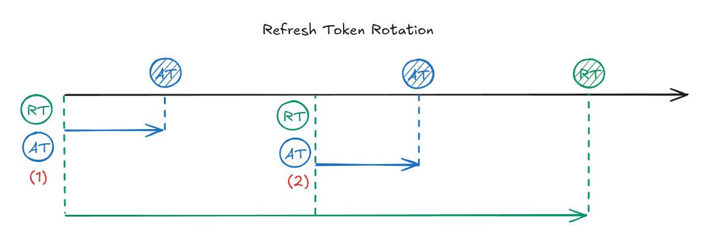

[ref link](https://auth0.com/docs/secure/tokens/refresh-tokens/refresh-token-rotation)

- Legitimate Client has refresh token 1, and it is leaked to or stolen by Malicious Client.
- Legitimate Client uses refresh token 1 to get a new refresh token/access token pair.
- Auth0 returns refresh token 2/access token 2.
- Malicious Client then attempts to use refresh token 1 to get an access token. Auth0 recognizes that refresh token 1 is being reused, and immediately invalidates the refresh token family, including refresh token 2.
- Auth0 returns an access denied response to Malicious Client.
- Access token 2 expires and Legitimate Client attempts to use refresh token 2 to request a new token pair. Auth0 returns an access denied response to Legitimate Client.
- Re-authentication is required.